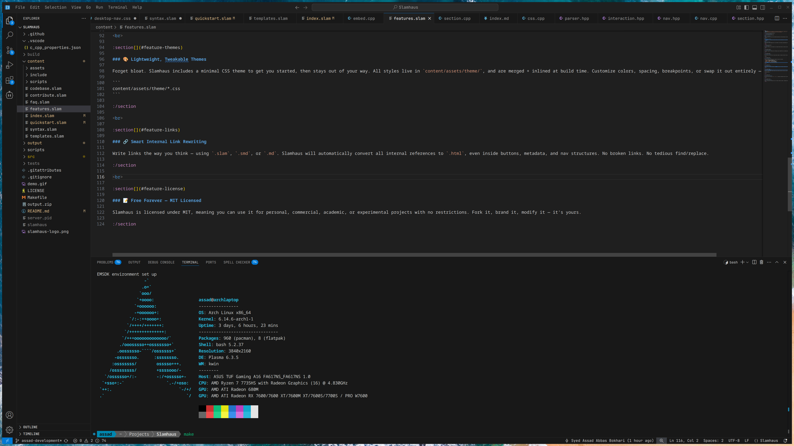

# Slamhaus Syntax

**Syntax highlighting for [Slamhaus](www.slamhaus.com) Markdown (.slam) files** — including custom tags, layout blocks, metadata, buttons, forms, and WebAssembly scripting.

Built to help you write, preview, and develop [Slamhaus-powered sites](www.slamhaus.com) with full editor support.

[Download Slamhaus](https://github.com/bitboyb/Slamhaus/releases/tag/nightly)

[Download VSCode Extension](https://open-vsx.org/extension/bitboyb/slamhaus-syntax)

---

## ✨ Features

* Full syntax highlighting for `.slam`, `.smd`, and `.md` files used in Slamhaus.
* Recognizes custom directives like:

  * `:section`, `:column`, `:/section`
  * `$page`, `$site`
  * `?button`, `?form`, `?input`, `?textarea`, `?/form`
  * `!image`, `!video`, `!iframe`, `!svg`
  * `@script`
* Highlights:

  * Declaration types
  * Parameter keys (`type:`, `action:`)
  * String values (`"value"`)
  * Terminator tags (`:/section`, `?/form`)

> Supports mixed Markdown and HTML with embedded Slamhaus syntax.

---

## 🛠 Requirements

* **Visual Studio Code 1.70.0+**
* No other dependencies required.
* Works out of the box for `.slam`, `.smd`, and `.md` files.

---

## ⚙️ Extension Settings

No settings yet — this extension is fully automatic on compatible file types.

---

## 🐞 Known Issues

* Multi-line nested declarations may not highlight correctly in rare cases.
* Embedded HTML+Slamhaus combos are not indented automatically (yet).

---

## 📦 Release Notes

### 0.0.1

* Initial release with full Slamhaus syntax support for:

  * all tags (`:section`, `$page`, `?form`, etc.)
  * embedded HTML
  * metadata, buttons, forms, and scripts
* Includes file associations for `.slam`, `.smd`, and `.md`

---

## 🧪 Development Workflow

Use this extension to:

1. Write `.slam` pages with full syntax highlighting
2. Test Slamhaus builds locally (`./slamhaus`)
3. Rapidly prototype static sites before public release

---

## 🚀 Coming Soon

* Intellisense for parameters and attribute keys
* Snippets for common Slamhaus components
* Live preview integration with Slamhaus CLI

---

## 🧠 About Slamhaus

Slamhaus is a C++17 static site generator that extends Markdown with powerful UI and scripting syntax. Learn more at [Slamhaus](https://github.com/bitboyb/Slamhaus).
